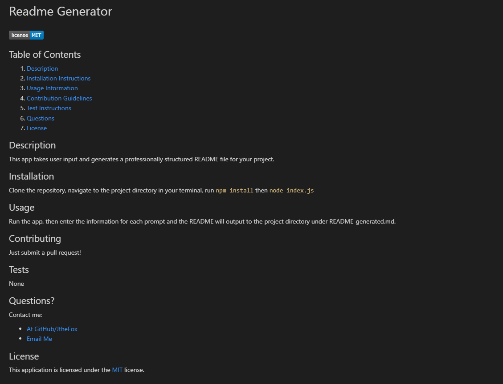

# Readme Generator

## Table of Contents
1. [Description](#description)
2. [Visuals](#visuals)
3. [Usage](#usage)
4. [Resources](#resources)

## Description
A Node app that uses the inquirer package to take user input and use it to generate a professionally structured readme file for your project.

## Usage
- Make sure you have [NodeJS](https://nodejs.org/en/download/) installed
- Clone the project to your machine
- Navigate to the project folder in your terminal, and run
```bash
node index.js
```
- Enter the information for each prompt
- Your readme will be created in a file called ```README-generated.md```


## Visuals


## Resources
- [Online Repository](https://github.com/JtheFox/readme-generator)
